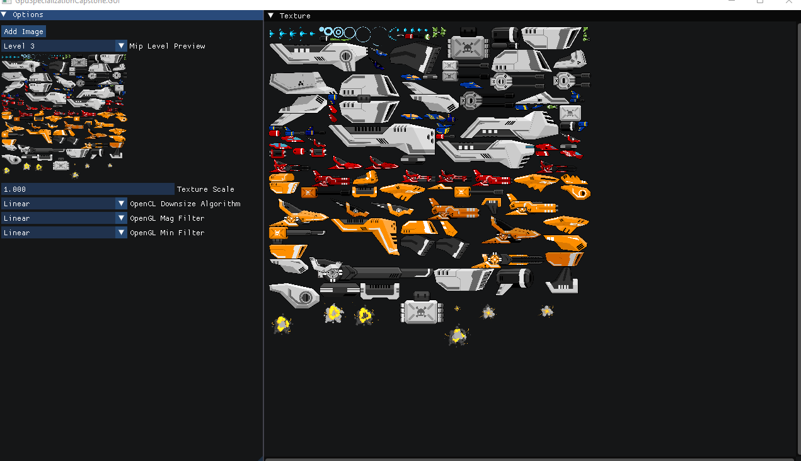

## GPU Specialization Capstone Project  
### OpenCL-Based Image Downsampling for Mipmap Generation

### Overview

The goal of this project is to implement **GPU-accelerated image downsampling** using **OpenCL**, with the primary use case being **mipmap generation** for graphics APIs such as **OpenGL**, **Direct3D 11**, and **Vulkan**.

Mipmaps are precomputed, downscaled versions of a texture, where each level is reduced by a factor of two in both width and height. For example:

- Level 0: 1024 × 1024 (original image)
- Level 1: 512 × 512
- Level 2: 256 × 256
- Level 3: 128 × 128

Using mipmaps improves rendering performance and visual quality by reducing texture aliasing and cache misses.

Although the course primarily focused on **CUDA**, this project intentionally uses **OpenCL** to avoid vendor lock-in and to demonstrate a portable GPGPU solution that serves the same purpose across different hardware vendors.

Since this is a demonstration project, two simple downsampling algorithms are implemented.

---

### Implemented Downsampling Algorithms

#### Nearest-Neighbor Downsampler

This method selects a single pixel from each 2×2 pixel block in the source image (typically the top-left pixel) to produce the next mip level. While very fast, this approach may introduce aliasing artifacts and visible pixelation.

#### Linear Downsampler

This method samples a 2×2 pixel block from the source image and computes the average color to produce each output pixel. Compared to nearest-neighbor sampling, this produces smoother and higher-quality mipmaps.

---

### Usage

To use the application, build and run the project, then interact with the graphical user interface.

The GUI is divided into two main sections: **Options** and **Mip Level Preview**.

#### Controls

- **Add Image**  
  Load any `.png` image into the application.

- **Mip Level Preview**  
  Select the mipmap level to preview.  
  Level 0 represents the original image; each subsequent level is downscaled by a factor of two.

- **Texture Scale**  
  Zoom in or out of the previewed texture.

- **OpenCL Downscale Algorithm**  
  Select the downsampling algorithm.  
  Changing this option automatically executes the OpenCL pipeline and regenerates all mipmap levels.

- **OpenGL Magnification Filter**  
  The filter used by OpenGL when the texture is magnified (zoomed in).

- **OpenGL Minification Filter**  
  The filter used by OpenGL when the texture is minified (zoomed out).

---




### Code Organization

The project is written in C# and uses OpenCL for GPU compute. Rendering and the user interface are handled via OpenGL and the [ImGui](https://github.com/ocornut/imgui) library.

All three low-level APIs (OpenCL, OpenGL, and ImGui) are accessed through the [Silk.NET](https://dotnet.github.io/Silk.NET/) bindings.

The codebase is split into two projects:

- **GPUSpecializationCapstone**  
  Contains the OpenCL pipeline responsible for mipmap generation (the `Downsampler` class), as well as implementations of the two downscaling algorithms: `NearestNeighbourImageDownsizer` and `LinearImageDownsizer`.  
  It also includes shared utility code for OpenCL and OpenGL setup and management, such as the `OpenCLContextUtilities` class.

- **GPUSpecializationCapstone.GUI**  
  Contains the graphical user interface and visualization logic, and builds on the core functionality provided by the main project.

#### Relevant Course Components

In the context of the course, the most relevant classes are:

- `LinearImageDownsizer`
- `NearestNeighbourImageDownsizer`
- `Downsampler`

These classes encapsulate the OpenCL kernel code and are responsible for constructing and executing the OpenCL processing pipeline used for image downsampling and mipmap generation.

The `Downsampler` class acts as the high-level coordinator, while the individual downsizer implementations define the specific sampling strategy and associated kernel logic.

### Example: `LinearImageDownsizer`

The `LinearImageDownsizer` class serves as a concrete example of how a downsampling algorithm is implemented in this project. It defines the OpenCL kernel for linear filtering and demonstrates how kernel arguments are set up and dispatched as part of the overall pipeline.


```c#
public class LinearImageDownsizer : IImageDownsizer
{
    private const string PROGRAM_SOURCE_CODE = @"
         __constant sampler_t kLinearSampler =
                CLK_NORMALIZED_COORDS_FALSE |
                CLK_ADDRESS_CLAMP |
                CLK_FILTER_LINEAR;

        __kernel __attribute__((reqd_work_group_size(8, 8, 1)))
        void downsample_linear(
            __read_only  image2d_t src,
            __write_only image2d_t dst,
            int step
        ) {
        int2 gid = (int2)(get_global_id(0), get_global_id(1));
        int2 srcCoord = gid * step;

        int2 srcSize = (int2)(
            get_image_width(src),
            get_image_height(src)
        );
        
        int2 dstSize = (int2)(
            get_image_width(dst),
            get_image_height(dst)
        );
        
        if (gid.x >= dstSize.x || gid.y >= dstSize.y ||
            srcCoord.x >= srcSize.x || srcCoord.y >= srcSize.y)
            return;
        
        float4 colorTopLeft = read_imagef(src, kLinearSampler, srcCoord);
        float4 colorTopRight = read_imagef(src, kLinearSampler, srcCoord + (int2)(1,0));
        float4 colorBottomRight = read_imagef(src, kLinearSampler, srcCoord + (int2)(1,1));
        float4 colorBottomLeft =  read_imagef(src, kLinearSampler, srcCoord + (int2)(0,1));

        write_imagef(dst, gid, (colorTopLeft + colorTopRight + colorBottomRight + colorBottomLeft) / 4.0f);
        }";
    
    private readonly CL _cl;
    private readonly nint _context;
    private readonly nint _queue;
    private readonly nint _program;
    private readonly nint _kernel;
    
    private OpenCLTexture? _sourceImage;
    private OpenCLTexture? _destinationImage;
    
    private int _level;
    private uint _step;
    
    /// <summary>
    /// The constructor.
    /// </summary>
    /// <param name="cl">The <see cref="CL"/> api.</param>
    /// <param name="context">The context pointer.</param>
    /// <param name="device">The device pointer.</param>
    /// <param name="queue">The command queue pointer.</param>
    public LinearImageDownsizer(CL cl, nint context, nint device, nint queue)
    {
        _cl = cl;
        _context = context;
        _queue = queue;
        _program = OpenCLProgramUtilities.CreateProgram(cl, context, device, PROGRAM_SOURCE_CODE);
        _kernel = OpenCLKernelUtilities.Create(cl, _program, "downsample_linear");
    }

    /// <inheritdoc/>
    public void SetupLevel(uint level, OpenCLTexture sourceImage)
    {
        _level = (int)level;
        _sourceImage = sourceImage;
        _step = (uint) Math.Pow(2, _level);
        
        _destinationImage = new OpenCLTexture(_cl, _context, _queue, sourceImage.Width / _step, sourceImage.Height / _step);
        _destinationImage.Initialize();
    }

    /// <inheritdoc/>
    public unsafe void Run()
    {
        if (_sourceImage is null || _destinationImage is null)
        {
            throw new InvalidOperationException(
                $"{nameof(NearestNeighborImageDownsizer)} requires a source image. Call {nameof(SetupLevel)}() first.");
        }
        
        int step = (int) _step;
        IntPtr sourceImagePtr = new  IntPtr(_sourceImage.Handle);
        IntPtr destinationImagePtr = new  IntPtr(_destinationImage.Handle);
        CheckError(_cl.SetKernelArg(_kernel, 0u, (uint) sizeof(void*), ref sourceImagePtr));
        CheckError(_cl.SetKernelArg(_kernel, 1u, (uint) sizeof(void*), ref destinationImagePtr));
        CheckError(_cl.SetKernelArg(_kernel, 2u, sizeof(int), &step));
        
        UIntPtr* localSize = stackalloc UIntPtr[2] { new UIntPtr(8), new  UIntPtr(8) };
        UIntPtr* globalSize = stackalloc UIntPtr[2]
        {
            new UIntPtr((uint) ((_destinationImage.Width + 7) & ~7)),
            new UIntPtr((uint) ((_destinationImage.Height + 7) & ~7))
        };
        
        int error = _cl.EnqueueNdrangeKernel(_queue, _kernel, 2, null, 
            globalSize, localSize,
            0, null, null);
        CheckError(error);
    }

    /// <inheritdoc/>
    public byte[] ReadImage(out uint width, out uint height)
    {
        if (_destinationImage is null)
        {
            throw new InvalidOperationException($"Destination image is null. Make sure to call {nameof(NearestNeighborImageDownsizer)}.{nameof(Run)}().");
        }
        
        width = _destinationImage.Width;
        height = _destinationImage.Height;
        return OpenClImageUtilities.ReadImage(_cl,_queue, _destinationImage.Handle, width, height);
    }

    /// <inheritdoc/>
    public void Dispose()
    {
        _cl.ReleaseKernel(_kernel);
        _cl.ReleaseProgram(_program);
        _destinationImage?.Dispose();
    }
}
```